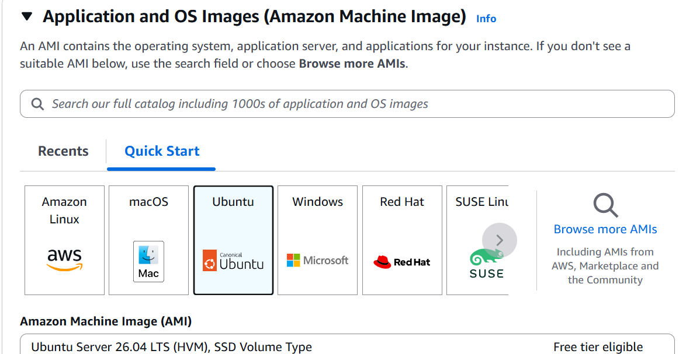
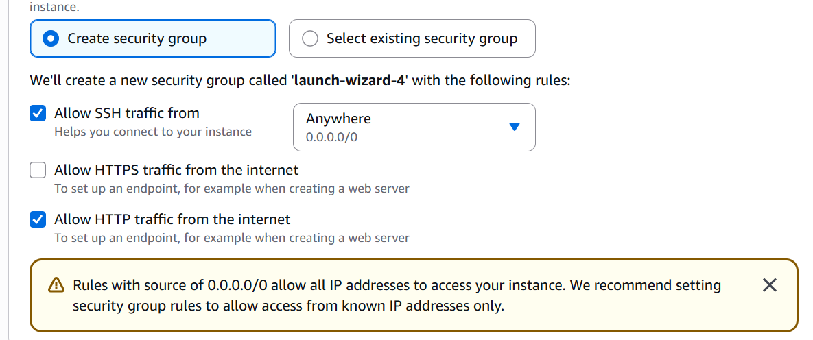
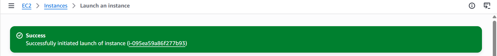
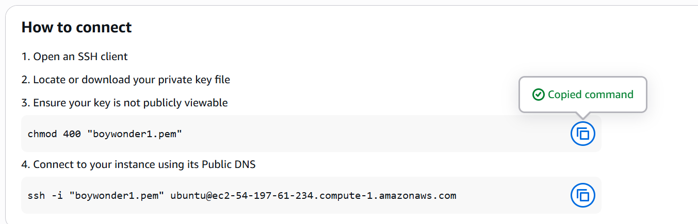
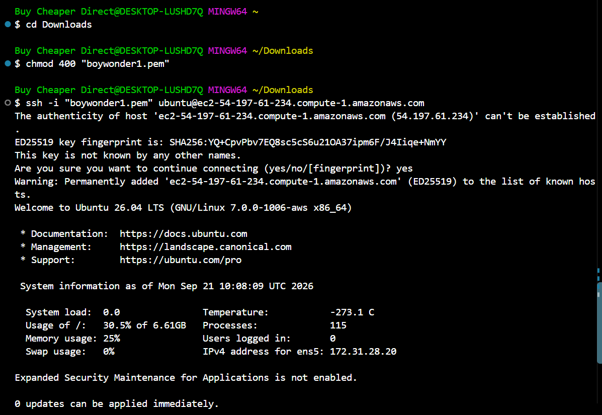
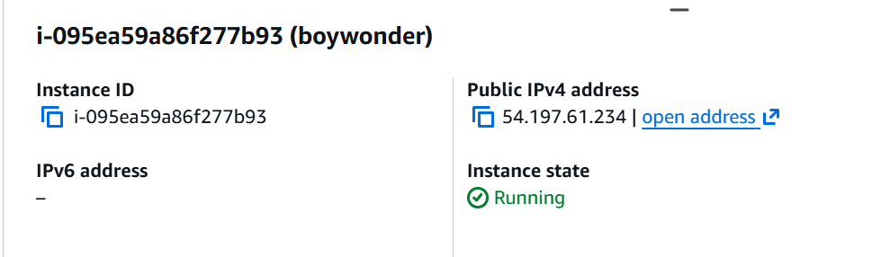
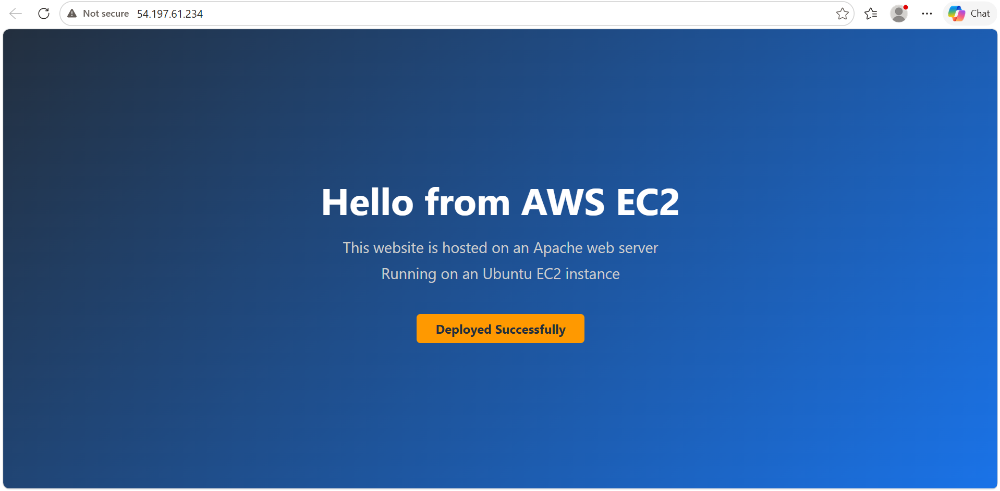

# AMAZON EC2 DEPLOYMENT

This project documentation shows the process I used to launch an EC2 Instance in the cloud and deployed a website.

# SELECT AMI (Amazon Machine Image)

I selected an AMI based on the compatibility of the AMI (processor architecture, virtualization mode, and operating system) with my EC2 Instance.

# Setup Security group

**SSH** - Allowing you to connect to your instance from your IP

**HTTP**- Allowing users to access the instance from anywhere
 

# Launch Instance

# SSH into Instance

The next thing is to SSH into your instance via a SSH Client (terminal). Follow the steps.

# Install nginx as web server

Install nginx using the following commands;

>sudo apt update -y

>sudo apt install nginx -y 

immediately after installation nginx starts working.

# Open your Public IP Address using port 80 i.e. regular HTTP. You will see the landing page for nginx.

# Replace nginx with your web page

Now to replace nginx default welcome page with your own website you will edit the website files which are stored in /var/www/html/. Use sudo vim /var/www/html/index.html to edit and replace with the content of your own index.html file. Go back to your public IP and refresh and you will see your application working.

